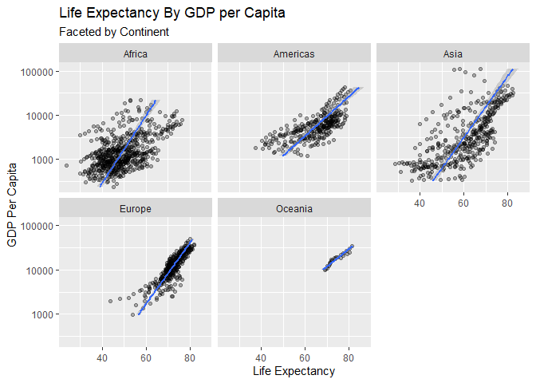

# Emily Arnold Class participation 1/20 (class 2)

## R Markdown

``` r
library(tidyverse)
```

    ## -- Attaching packages ------------------------------------- tidyverse 1.2.1 --

    ## v ggplot2 3.2.0     v purrr   0.3.2
    ## v tibble  2.1.3     v dplyr   0.8.3
    ## v tidyr   0.8.3     v stringr 1.4.0
    ## v readr   1.3.1     v forcats 0.4.0

    ## -- Conflicts ---------------------------------------- tidyverse_conflicts() --
    ## x dplyr::filter() masks stats::filter()
    ## x dplyr::lag()    masks stats::lag()

``` r
library(ggplot2)
library(gapminder)
```

    ## Warning: package 'gapminder' was built under R version 3.6.2

``` r
library(ggthemes)
```

    ## Warning: package 'ggthemes' was built under R version 3.6.2

Let’s get the data ready

``` r
data("gapminder")

str(gapminder)
```

    ## Classes 'tbl_df', 'tbl' and 'data.frame':    1704 obs. of  6 variables:
    ##  $ country  : Factor w/ 142 levels "Afghanistan",..: 1 1 1 1 1 1 1 1 1 1 ...
    ##  $ continent: Factor w/ 5 levels "Africa","Americas",..: 3 3 3 3 3 3 3 3 3 3 ...
    ##  $ year     : int  1952 1957 1962 1967 1972 1977 1982 1987 1992 1997 ...
    ##  $ lifeExp  : num  28.8 30.3 32 34 36.1 ...
    ##  $ pop      : int  8425333 9240934 10267083 11537966 13079460 14880372 12881816 13867957 16317921 22227415 ...
    ##  $ gdpPercap: num  779 821 853 836 740 ...

``` r
ggplot()
```

<!-- -->

``` r
ggplot(data = gapminder, mapping = aes(x = year, y = pop))+
  geom_point()
```

<!-- -->

``` r
#OR

#do it this way to layer other data on 
ggplot()+
  geom_point(data = gapminder, mapping = aes(x = year, y = pop))
```

<!-- -->

To add
color…

``` r
ggplot(data = gapminder, mapping = aes(x = year, y = pop, col = continent))+
  geom_point()
```

<!-- -->

What if we aggregate by continent…

``` r
gapminder %>% 
  group_by(year, continent) %>% 
  summarize(pop = sum(pop, na.rm = TRUE)) %>% 
  ggplot(., mapping = aes(x = year, y = pop, col = continent))+
  geom_point()+
  scale_y_log10()
```

    ## Warning in summarise_impl(.data, dots, environment(), caller_env()):
    ## integer overflow - use sum(as.numeric(.))
    
    ## Warning in summarise_impl(.data, dots, environment(), caller_env()):
    ## integer overflow - use sum(as.numeric(.))
    
    ## Warning in summarise_impl(.data, dots, environment(), caller_env()):
    ## integer overflow - use sum(as.numeric(.))
    
    ## Warning in summarise_impl(.data, dots, environment(), caller_env()):
    ## integer overflow - use sum(as.numeric(.))
    
    ## Warning in summarise_impl(.data, dots, environment(), caller_env()):
    ## integer overflow - use sum(as.numeric(.))
    
    ## Warning in summarise_impl(.data, dots, environment(), caller_env()):
    ## integer overflow - use sum(as.numeric(.))
    
    ## Warning in summarise_impl(.data, dots, environment(), caller_env()):
    ## integer overflow - use sum(as.numeric(.))
    
    ## Warning in summarise_impl(.data, dots, environment(), caller_env()):
    ## integer overflow - use sum(as.numeric(.))

    ## Warning: Removed 8 rows containing missing values (geom_point).

<!-- -->

``` r
gapminder %>% 
  filter(continent == "Asia") %>% 
ggplot(., mapping = aes(x = year, y = gdpPercap, color = country))+
  geom_point()+
  facet_wrap(~continent)
```

<!-- -->

Trying this with two numeric
measures…

``` r
ggplot(data = gapminder, mapping = aes(x = gdpPercap, y = lifeExp, size = pop, color = continent))+
  geom_point()+
  scale_x_log10()+
  stat_smooth(method = 'lm')
```

<!-- -->

``` r
gapminder %>% 
  filter(continent == "Oceania") %>% 
  # group_by(country) %>% 
  # summarize(gdpPercap = mean(gdpPercap), lifeExp = mean(lifeExp)) %>% 
ggplot(., mapping = aes(x = gdpPercap, y = lifeExp, shape = country))+
  geom_point()+
  scale_x_log10()+
  stat_smooth(method = 'lm')
```

<!-- -->

Back to square
one

``` r
ggplot(data = gapminder, mapping = aes(x = gdpPercap, y = lifeExp, color = continent))+
  # geom_point()+
  scale_x_log10()+
  stat_smooth(method = 'lm')
```

<!-- -->

``` r
ggplot(data = gapminder, mapping = aes(x = gdpPercap, y = lifeExp, linetype = continent))+
  # geom_point()+
  scale_x_log10()+
  stat_smooth(method = 'lm')
```

<!-- -->

``` r
ggplot(data = gapminder, mapping = aes(x = gdpPercap, y = lifeExp))+
  geom_point(aes(color = continent, alpha = pop))+ #or you can specify an actual value, outisde the aes 
  scale_x_log10()+
  stat_smooth(method = 'lm')
```

<!-- -->

``` r
ggplot(data = gapminder, mapping = aes(x = gdpPercap, y = lifeExp))+
  geom_point(aes(color = continent), alpha = .3)+
  scale_x_log10()+
  stat_smooth(method = 'lm', mapping = aes(color = continent))
```

<!-- -->

``` r
ggplot(data = gapminder, mapping = aes(x = gdpPercap, y = lifeExp))+
  geom_point(alpha = .3)+
  scale_x_log10()+
  stat_smooth(method = 'lm')+
  facet_wrap(~continent)+
  xlab("GDP Per Capita")+
  ylab("Life Expectancy")+
  ggtitle("Life Expectancy By GDP per Capita", subtitle = "Faceted by Continent")
```

<!-- -->

Getting weird again

``` r
ggplot(data = gapminder, mapping = aes(x = gdpPercap, y = lifeExp))+
  geom_point(alpha = .3)+
  scale_x_log10()+
  stat_smooth(method = 'lm')+
  facet_wrap(~continent)+
  xlab("GDP Per Capita")+
  ylab("Life Expectancy")+
  ggtitle("Life Expectancy By GDP per Capita", subtitle = "Faceted by Continent")+
  coord_flip()
```

<!-- -->

``` r
ggplot(data = gapminder, mapping = aes(x = continent, y = lifeExp))+
  geom_boxplot()
```

<!-- -->

``` r
ggplot(data = gapminder, mapping = aes(x = continent, y = lifeExp))+
  geom_boxplot()+
  geom_point()+
  coord_flip()+
  theme_void()
```

<!-- -->

``` r
ggplot(data = gapminder, mapping = aes(x = continent, y = lifeExp))+
  stat_summary(fun.ymin = min,
               fun.ymax = max,
               fun.y = median)+
  geom_point()+
  coord_flip()+
  theme_classic()
```

<!-- -->

``` r
ggplot(data = gapminder, mapping = aes(x = continent, y = lifeExp))+
  stat_summary(fun.ymin = min,
               fun.ymax = max,
               fun.y = median)+
  geom_point()+
  coord_flip()+
  theme_classic()
```

<!-- -->
